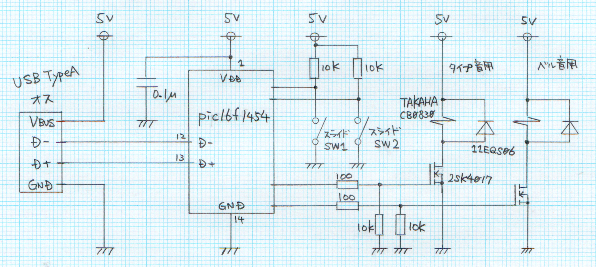

# FTW-TT_50_USB  

## 概要  
現代の消音キーボードに反抗すべく，タイプライターを叩いた時の音を楽しめるデバイスを作成する．  
タイプライター風キーボードも売ってはいるが，それを使っては味気ないので，外付けUSBデバイスとして実装する．  

## ハードウェア設計  
### 構成  
### 回路図　　
足りない部品があるので，後で修正
* picマイコンのピン番号追記(現物合わせで決める)  
* Vddに電解コンデンサ追加  
* Vusb(？)みたいなピンに積層セラミックコンデンサ追加  
  

## ソフトウェア設計  
### PC側  
### デバイス側