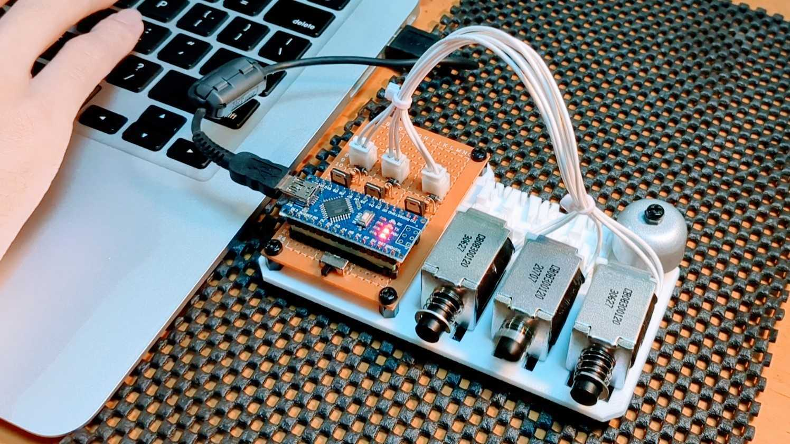
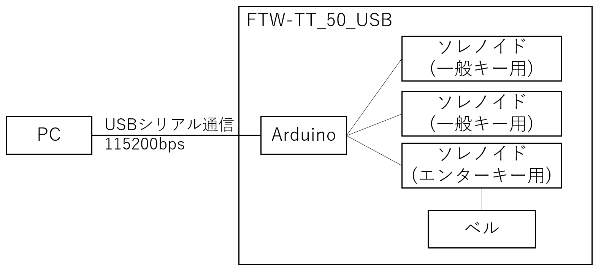
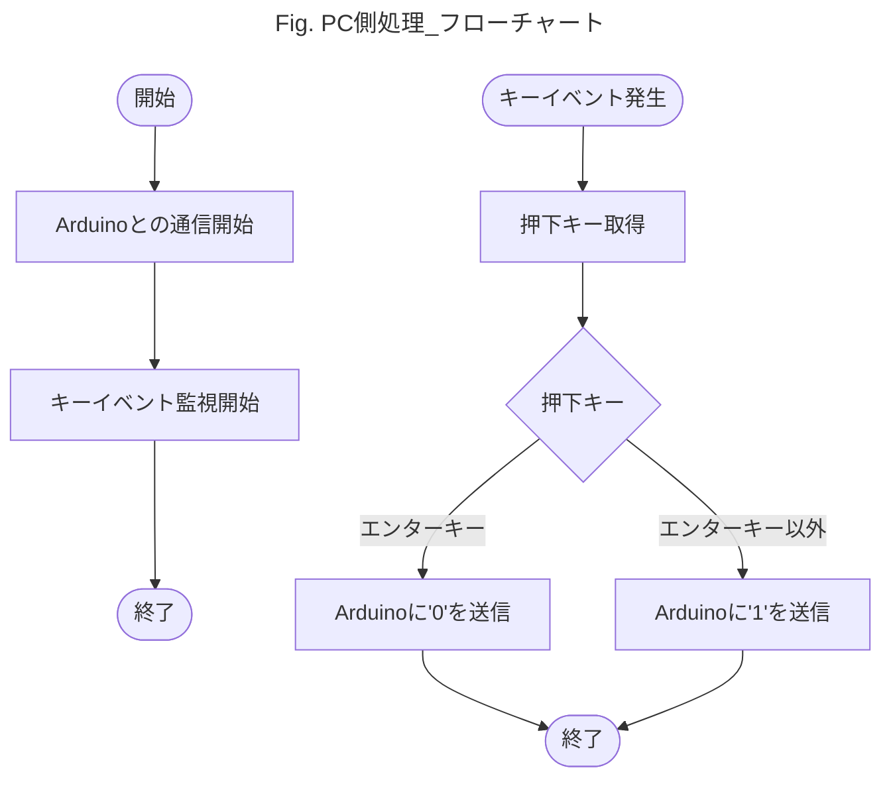
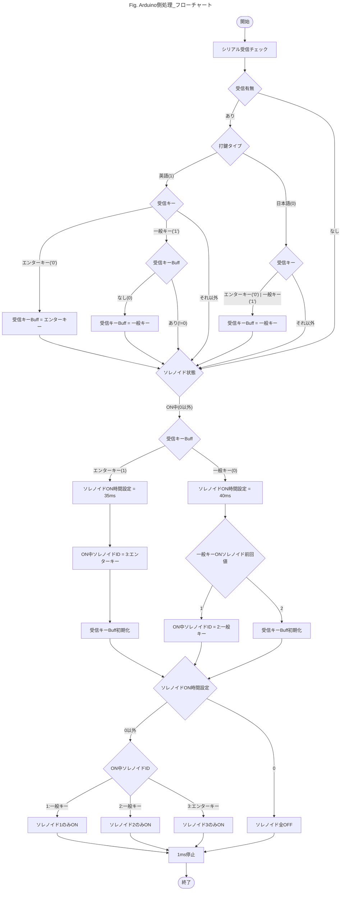

# FTW-TT_50_USB  

Fake Type Writer - Tetora Tech lab _ 5.0v _ USB drive  
テトラ技研製 USB駆動 ニセタイプライター  

**[紹介動画](https://youtu.be/UQrdH8_pX44?si=VVSs2FK_6RHxstvM)**

## 背景  
現代の消音キーボードに反抗すべく、タイプライターを叩いた時の音を楽しめるデバイスを作成する。  
タイプライター風キーボードも売ってはいるが、それを使っては味気ないので、外付けUSBデバイスとして実装する。  
当初、リレーで音を出そうと考えていたが、よくよく調べてみると二番煎じだった。  
そのため、急遽ソレノイドで音を出す仕様に変更した...   
[Silriumさん_USB KeyBoard RELAY](https://makezine.jp/blog/2015/08/mft2015_silrium.html)

## 概要  
キータイプ時にソレノイドを動作させ、タイプライターの音を表現する。  
音は2種類用意する。

| キー種類     | 音           | 備考                   | 
| ------------ | ------------ | ---------------------- | 
| 一般キー     | メカニカル音 | エンターキー以外のキー | 
| エンターキー | ベル音       |                        |  

メカニカル音はソレノイドの動作音で再現する。  
ベル音はタイプライターの文字送り催促ベルを指しており、自転車のベルで再現する。  

## ハードウェア設計  
### 構成  
一般キー押下時の音を再現するために、ソレノイドを接続する。  
タイピングの間隔が80msを下回ると、ソレノイドのデッドタイムとかぶるため、一般キー用のソレノイドを2つ接続して対策する。  
エンターキー押下時の音は、ベルを鳴らすことで対応する。  
なお、エンターキーの押下間隔は80msを下回らないと仮定して、ソレノイドは1つのみ接続する。  
 

### 回路図  
小型化を狙いpicマイコンで実装しようとしたが、時間が無いのでArduinoを使用する。  
Arduino Microを使用して設計したが、電源回りが弱いようで5Vピンから5V出力されないため、Nanoを使用する。  
使用するソレノイドには、ON/OFF 40[ms]ずつ計80[ms]のデッドタイムがあり、一般キー押下タイミングによっては、反応が追い付かない。  
そのため、ソレノイドを2個設置し、40[ms]のデッドタイムとすることで対応する。  
なお、2個以上のソレノイドを同時に動作させることはUSB2.0の規格上、電流が大きすぎるため同時動作ソレノイドは1つまでとする。  
  

## ソフトウェア設計  
### PC側  

### デバイス側  
なぜ関数化しなかったのかが悔やまれるが、展示ギリギリだったので許してほしい。  

