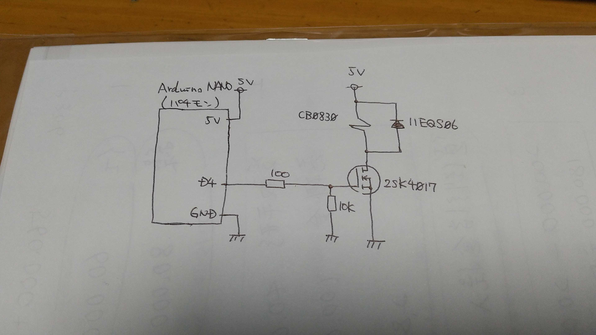

# solenoidOperationCheck    

ソレノイドの最適なON/OFF時間を模索するためのS/Wを作成する．  
ソレノイドON/OFF時間が短すぎると，ソレノイドが反応する前に処理が完了してしまうため，最適な時間を求める意図がある．  

## 仕様  
シリアル通信でソレノイドON/OFF時間を指定する．  

### コマンド一覧  

|コマンド|結果|
|:---|:---|
|on [数字]|ソレノイドのON時間を指定する(ms)|
|off [数字]|ソレノイドのOFF時間を指定する(ms)|
|continue|連続稼働|
|single|単発稼働|
|start|開始|
|s|停止|

## 回路図

## 結果  
ON/OFF時間ともに，40[ms]が最小時間となった． 
動作動画↓   
[Twitter動画埋め込めないので，リンク貼っときます](https://twitter.com/TetoraTechLab/status/1645044216073191426)